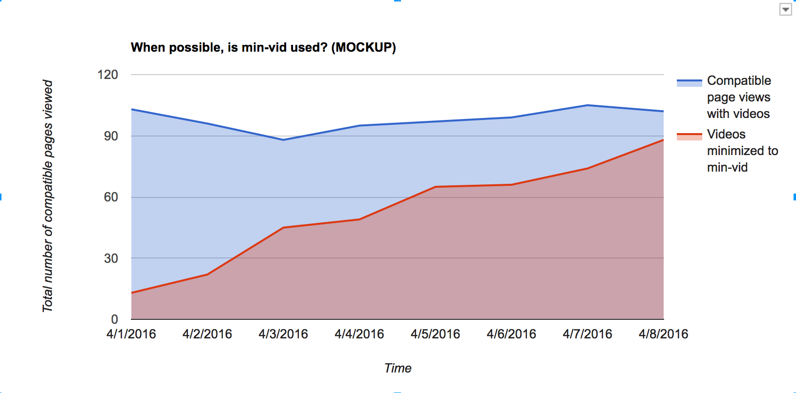

# METRICS

## Data Analysis
The collected data will primarily be used to answer the following questions.
Images are used for visualization and are not composed of actual data.

### Do people want to use this?

What is the overall usage of min-vid?  **This is the standard DAU/MAU
analysis.**  This graph reports overall installations of min-vid, but does not
report actual usage of the add-on's functionality.


On pages where compatible video elements exist and are playing, how often is min-vid initialized?




### Additional interesting questions

- How are min-vid sessions initiated? Current options include doorhanger, context menu, and universal search.
- How long is a video kept minimized?
- What sites are used the most? (youtube, random video elements etc)
- What is the most common placement and size for the video frame?


## Data Collection

Min-vid has no server side component, so all data is gathered on the client and
reported via Firefox's Telemetry System.  Due to the overall low volume of data
pings, min-vid will not do any batching on the client side, instead sending
pings immediately.  Pings will be sent:

* When a user visits a page on a whitelisted domain which contains a video element **which is playing**
  * The action is recorded as 'available'
* When a user interacts with min-vid, actions include:
  * 'activate', 'deactivate' -- using min-vid itself
  * 'play', 'pause', 'seek', 'volume'  --  all buttins in min-vid UI
  * 'resize', 'move', 'fullscreen' -- positioning of min-vid
* When a video ends without user-interaction
  * The action is recorded as 'end'

Here's an example of the `payload` portion of a Test Pilot telemetry ping:

```js
{
  "test": "@min-vid",                // The em:id field from the add-on
  "agent": "User Agent String",
  "payload": {
    "action": "activate",            // see full list above
    "activated_from": "contextmenu", // or '' or 'doorhanger' or 'universalsearch'
    "domain": "youtube.com",         // This domain will be in our whitelist of sites
    "doorhanger_prompted": true,     // did we prompt? (regardless of if it was clicked)
    "doorhanger_clicked": true,
    "video_x": 1200,                 // All dimensions in pixels
    "video_y": 1150,
    "video_width": 300,
    "video_height": 110
  }
}
```

A Redshift schema for the payload:

```js
local schema = {
--   column name                   field type   length  attributes   field name
    {"timestamp",                  "TIMESTAMP", nil,    "SORTKEY",   "Timestamp"},
    {"uuid",                       "VARCHAR",   36,      nil,         get_uuid},

    {"test",                       "VARCHAR",   255,     nil,         "Fields[test]"},

    -- Parsed automatically from the `agent` field
    {"user_agent_browser",         "VARCHAR",   255,     nil,         "Fields[user_agent_browser]"},
    {"user_agent_os",              "VARCHAR",   255,     nil,         "Fields[user_agent_os]"},
    {"user_agent_version",         "VARCHAR",   255,     nil,         "Fields[user_agent_version]"},

    {"action",                     "VARCHAR",   255,     nil,         "payload[action]"},
    {"activated_from",             "VARCHAR",   255,     nil,         "payload[activated_from]"},
    {"domain",                     "VARCHAR",   255,     nil,         "payload[domain]"},
    {"doorhanger_prompted",        "BOOLEAN",   nil,     nil,         "payload[doorhanger_prompted]"},
    {"doorhanger_clicked",         "BOOLEAN",   nil,     nil,         "payload[doorhanger_clicked]"},

    {"video_x",                    "BOOLEAN",   nil,     nil,         "payload[video_x]"},
    {"video_y",                    "BOOLEAN",   nil,     nil,         "payload[video_y]"},
    {"video_width",                "BOOLEAN",   nil,     nil,         "payload[video_width]"},
    {"video_height",               "BOOLEAN",   nil,     nil,         "payload[video_height]"}
}
```

Note that we are *not* recording which videos are watched, only the domain it was watched on.

All data is kept by default for 180 days.
