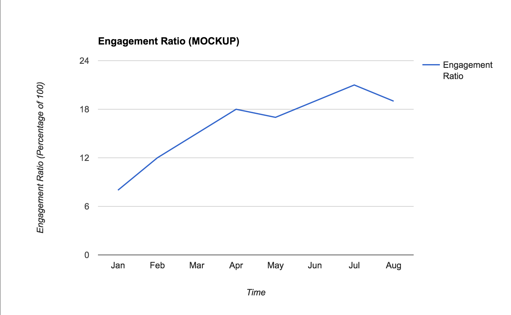

# METRICS

## Data Analysis
The collected data will primarily be used to answer the following questions.
Images are used for visualization and are not composed of actual data.

### Do people want to use this?

What is the overall usage of min-vid?  **This is the standard DAU/MAU
analysis.**  This graph reports overall installations of min-vid, but does not
report actual usage of the add-on's functionality.



On pages where compatible video elements exist and are playing, how often is min-vid initialized?


### Additional interesting questions

- How are min-vid sessions initiated? Current options include doorhanger and context menu.
  - NOTE: doorhanger integration is not implemented.
- How long is a video kept minimized?
- What sites are used the most? (youtube, random video elements etc)
- What is the most common placement and size for the video frame?


## Data Collection

Min-vid has no server side component, so all data is gathered on the client and
reported via Firefox's Telemetry System. min-vid will not do any batching on
the client side, instead sending pings immediately.

### Event types

Here is the full range of event types sent by min-vid as the `action` key:

* `activate:contextmenu`
  * Sent when the user right-clicks a video and sends it to the min-vid player.
* `error_view:render`
  * Sent when the error view is displayed (a video failed to load).
* `loading_view:render`
  * Sent when the loading view is displayed.
* `loading_view:close`
  * Sent when the user clicks the 'close' button in the loading view before
    the video loads or fails to load.
* `player_view:render`
  * Sent when the player view is displayed.
* `player_view:video_loaded`
  * Sent when the video has loaded in the player view.
* `player_view:send_to_tab`
  * Sent when the user clicks the 'send to tab' button to open the video in a new window.
* `player_view:play`
  * Sent when the user clicks the 'play' button.
* `player_view:pause`
  * Sent when the user clicks the 'pause' button.
* `player_view:mute`
  * Sent when the user clicks the 'mute' button.
* `player_view:unmute`
  * Sent when the user clicks the 'unmute' button.
* `player_view:minimize`
  * Sent when the user clicks the 'maximize' button.
* `player_view:maximize`
  * Sent when the user clicks the 'maximize' button.
* `player_view:close`
  * Sent when the user clicks the 'close' button.

Here's an example of a complete Test Pilot telemetry ping. Note that min-vid only sends the
`payload` portion to the Test Pilot add-on. The Test Pilot add-on appends the `test` and `agent`
fields, and wraps the payload under the `payload` key.

```js
// Example: complete Test Pilot telemetry ping:
{
  "test": "@min-vid",                // The em:id field from the add-on
  "agent": "User Agent String",
  "payload": {
    "action": "activate:context_menu",  // Event type; see full list above
    "domain": "youtube.com",            // Domain from a whitelist of sites which may
                                        // change frequently

    "doorhanger_prompted": false,       // did we prompt? (regardless of if it was clicked)
                                        // always false until a doorhanger is implemented
    "doorhanger_clicked": false,        // always false until a doorhanger is implemented

    "video_x": 1200,                 // Distance in pixels from top of browser window
                                     // to top of min-vid panel
    "video_y": 1150,                 // Distance in pixels from left side of browser
                                     // window to left side of min-vid panel
    "video_width": 300,              // Width of min-vid player, in pixels
    "video_height": 110              // Height of min-vid panel, in pixels
  }
}
```

A Redshift schema for the payload:

```js
local schema = {
--   column name                   field type   length  attributes   field name
    {"timestamp",                  "TIMESTAMP", nil,    "SORTKEY",   "Timestamp"},
    {"uuid",                       "VARCHAR",   36,      nil,         get_uuid},

    {"test",                       "VARCHAR",   255,     nil,         "Fields[test]"},

    -- Parsed automatically from the `agent` field
    {"user_agent_browser",         "VARCHAR",   255,     nil,         "Fields[user_agent_browser]"},
    {"user_agent_os",              "VARCHAR",   255,     nil,         "Fields[user_agent_os]"},
    {"user_agent_version",         "VARCHAR",   255,     nil,         "Fields[user_agent_version]"},

    {"action",                     "VARCHAR",   255,     nil,         "payload[action]"},
    {"domain",                     "VARCHAR",   255,     nil,         "payload[domain]"},

    {"doorhanger_prompted",        "BOOLEAN",   nil,     nil,         "payload[doorhanger_prompted]"},
    {"doorhanger_clicked",         "BOOLEAN",   nil,     nil,         "payload[doorhanger_clicked]"},

    {"video_x",                    "BOOLEAN",   nil,     nil,         "payload[video_x]"},
    {"video_y",                    "BOOLEAN",   nil,     nil,         "payload[video_y]"},
    {"video_width",                "BOOLEAN",   nil,     nil,         "payload[video_width]"},
    {"video_height",               "BOOLEAN",   nil,     nil,         "payload[video_height]"}
}
```

Note that we are *not* recording which videos are watched, only the domain it was watched on.

All data is kept by default for 180 days.
